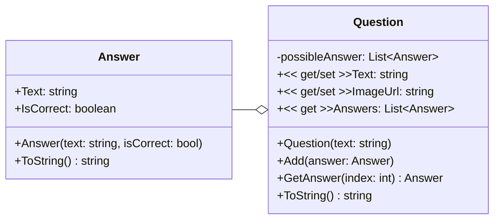
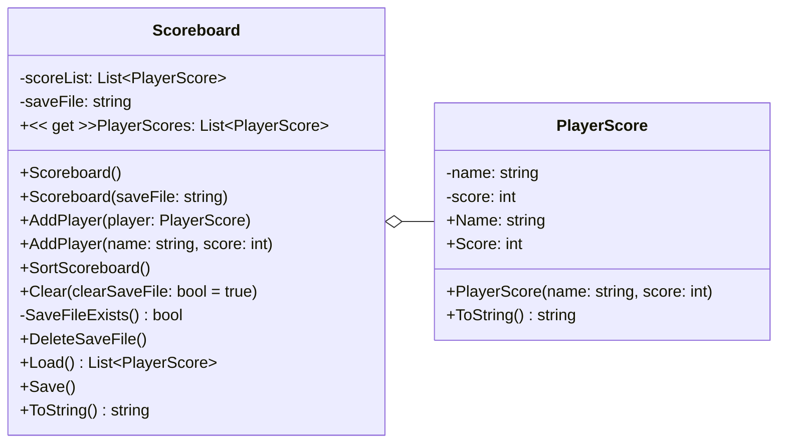
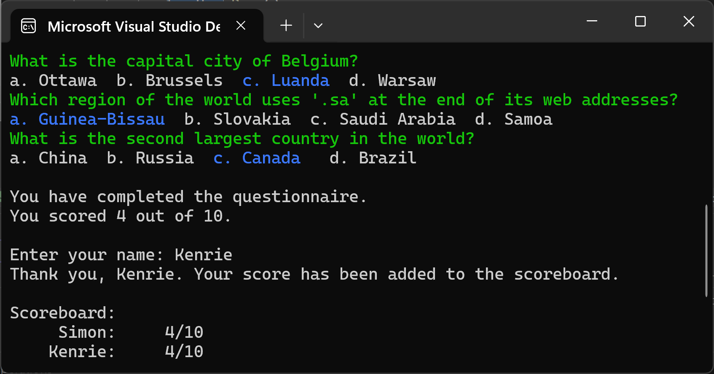
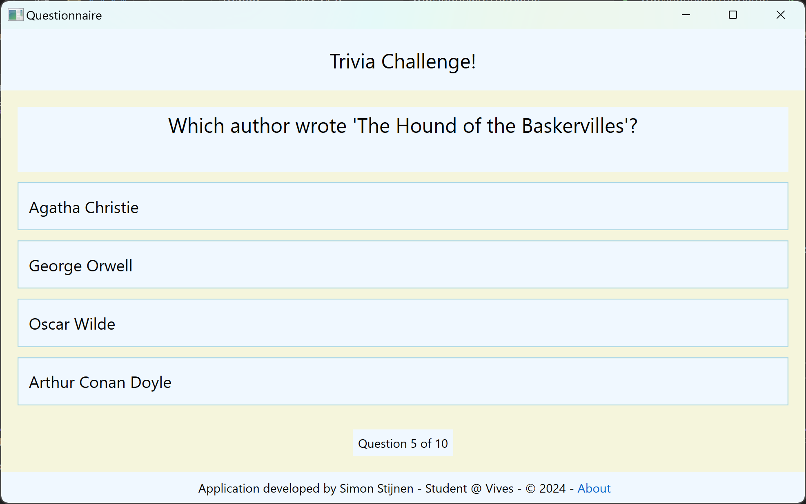
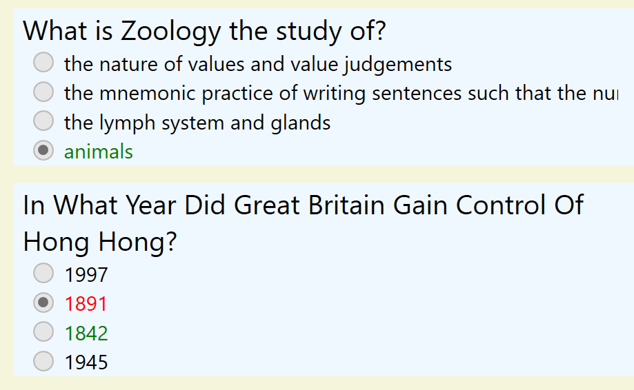

<h1 align="center">Questionnaire</h1>

<p align="center">
Questionnaire program for Object Oriented Programming Evaluatie 4
</p>

## Table of Contents

- [Table of Contents](#table-of-contents)
- [Author](#author)
- [Assignment](#assignment)
- [Setup and Usage](#setup-and-usage)
- [Questionnaire Library](#questionnaire-library)
  - [UML Diagram](#uml-diagram)
  - [Answer](#answer)
    - [Atributes](#atributes)
    - [Constructor](#constructor)
    - [Methods](#methods)
  - [Question](#question)
    - [Atributes](#atributes-1)
    - [Properties](#properties)
    - [Constructor](#constructor-1)
    - [Methods](#methods-1)
- [Scoreboard Library](#scoreboard-library)
  - [UML Diagram](#uml-diagram-1)
  - [Scoreboard](#scoreboard)
    - [Attributes](#attributes)
    - [Properties](#properties-1)
    - [Constructor](#constructor-2)
    - [Methods](#methods-2)
  - [PlayerScore](#playerscore)
    - [Attributes](#attributes-1)
    - [Constructor](#constructor-3)
    - [Methods](#methods-3)
- [Console Application](#console-application)
  - [Demo](#demo)
  - [The questions and answers](#the-questions-and-answers)
  - [Scoreboard](#scoreboard-1)
- [Questionnaire The Game - WPF Application](#questionnaire-the-game---wpf-application)
  - [Demo](#demo-1)
  - [Questions](#questions)
  - [Results](#results)

## Author

This application was created by [Simon Stijnen](https://github.com/SimonStnn). Student at [Vives University Of Applied Sciences](https://www.vives.be/nl/over-vives/campussen/vives-brugge-xaverianenstraat). Studying [Electronics - ICT](https://www.vives.be/nl/technology/elektronica-ict).

> 25/04/2024 -

## Assignment

This project is the 4th assignment for the Object Oriented Programming course. The assignment details can be found in the [assignment PDF](./Permanente%20evaluatie%204%20-%202024%20-%20versie%20a.pdf).

## Setup and Usage

To run this application you need to have the [.NET 6.0 SDK](https://dotnet.microsoft.com/download/dotnet/6.0) and [Visual Studio](https://visualstudio.microsoft.com/) installed on your machine.

Once these are installed you can start by cloning the repository

```bash
git clone https://github.com/SimonStnn/questionnaire.git
```

Then open the solution in Visual Studio and run the console application or the WPF application.

## Questionnaire Library

### UML Diagram



### Answer

#### Atributes

- `Text`: The text of the answer
- `IsCorrect`: If the answer is correct or not

#### Constructor

- `Answer(text: string, isCorrect: bool)`: Creates a new answer with the given text and if it is correct or not

#### Methods

- `ToString() string`: Returns the text of the answer

### Question

#### Atributes

- `possibleAnswer`: A list of possible answers

#### Properties

- `Text`: The text of the question
- `ImageUrl`: The url of the image of the question
- `Answers`: The list of possible answers

#### Constructor

- `Question(text: string)`: Creates a new question with the given text

#### Methods

- `Add(answer: Answer)`: Adds a possible answer to the question
- `GetAnswer(index: int): Answer`: Returns the answer at the given index
- `ToString() string`: Returns the text of the question

## Scoreboard Library

### UML Diagram



### Scoreboard

#### Attributes

- `scoreList`: A list of `PlayerScore` objects
- `saveFile`: The file to save the scoreboard to

#### Properties

- `PlayerScores`: The list of `PlayerScore` objects

#### Constructor

- `Scoreboard()`: Creates a new scoreboard
- `Scoreboard(saveFile: string)`: Creates a new scoreboard with the given save file

#### Methods

- `SaveFileExists() bool`: Checks if the save file exists
- `AddPlayer(player: PlayerScore)`: Adds a player to the scoreboard
- `AddPlayer(name: string, score: int)`: Adds a player to the scoreboard
- `SortScoreboard()`: Sorts the scoreboard by score
- `Clear(clearSaveFile: bool = true)`: Clears the scoreboard
- `DeleteSaveFile()`: Deletes the save file
- `Load() List~PlayerScore~`: Loads the scoreboard from the save file
- `Save()`: Saves the scoreboard to the save file
- `ToString() string`: Returns the scoreboard as a string

### PlayerScore

#### Attributes

- `name`: The name of the player
- `score`: The score of the player
- `Name`: The name of the player
- `Score`: The score of the player

#### Constructor

- `PlayerScore(name: string, score: int)`: Creates a new player score

#### Methods

- `ToString() string`: Returns the player score as a string

## Console Application

The console application will use the [Questionnaire](#questionnaire-library) and [Scoreboard](#scoreboard-library) libraries to create a simple quiz game. The game will ask the user a series of questions and keep track of the score. At the end of the game, the user's score will be saved to a file and displayed on the scoreboard.

### Demo

<!-- ./resources/videos/ConsoleAppDemo.mp4 -->
<https://github.com/SimonStnn/fractions/assets/113850648/8c0a8c47-445f-41c6-941b-4244761aee33>

> Demo video of the console application

### The questions and answers

The questions are propmted to the user as green text. And below each question, the possible answers are displayed. The user can use the arrow keys to navigate between the answers and press enter to select an answer. The selected answer is displayed as a blue text.

### Scoreboard

When the game is played again, the score from previous players is displayed on the scoreboard at the end.



In this case there are two players, `Simon` and `Kenrie`, both with a low score of `4/10`.

## Questionnaire The Game - WPF Application

The WPF application will use the [Questionnaire](#questionnaire-library) and [Scoreboard](#scoreboard-library) libraries to create a more interactive quiz game. The game will have a GUI where the user can answer questions and see their score in real-time. At the end of the game, the user's score will be saved to a file and displayed on the scoreboard.

### Demo

<!-- ./resources/videos/WPFTheGameDemo.mp4 -->
<https://github.com/SimonStnn/fractions/assets/113850648/3c1a6ece-e65c-42cf-be56-9d4570dfe133>

> Demo video of the WPF application

### Questions

A question is displayed at the top of the window, and the possible ansers are below that. For each possible answer a button is provided.



### Results

The results of the game are displayed in a new page. The user can see what they answered and what the correct answer was.



Here we can see that the user answered the first question correctly and the second incorrectly. The users answers are marked by the ckecked checkbox. If the user answered the question correctly, the text is green, otherwise it is red and the correct answer is green.
