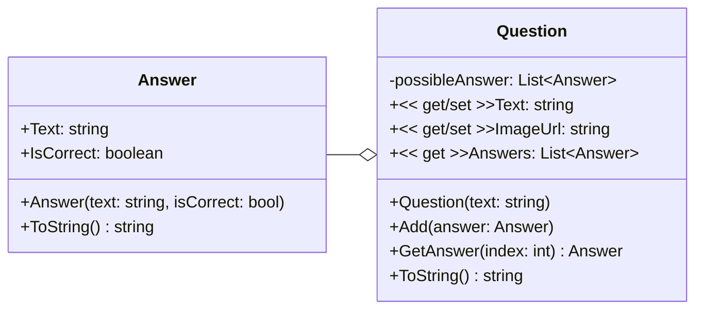
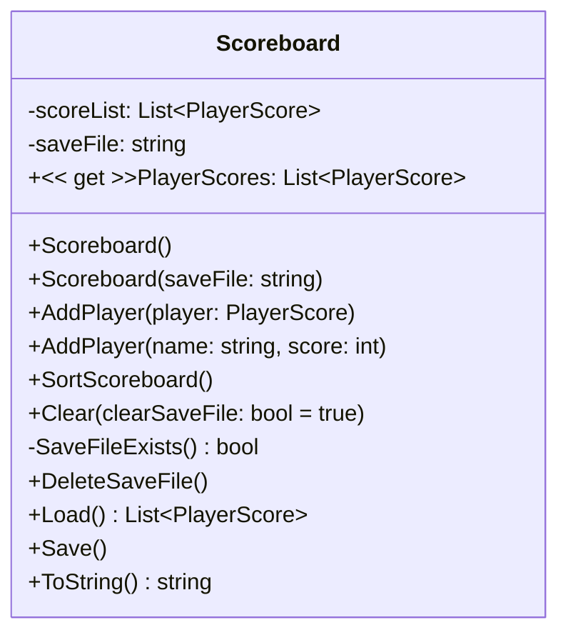

<h1 align="center">Questionnaire</h1>

Questionnaire program for Object Oriented Programming Evaluatie 4

## Table of Contents

- [Table of Contents](#table-of-contents)
- [Author](#author)
- [Assignment](#assignment)
- [Questionnaire Library](#questionnaire-library)
  - [UML Diagram](#uml-diagram)
  - [Answer](#answer)
    - [Atributes](#atributes)
    - [Constructor](#constructor)
    - [Methods](#methods)
  - [Question](#question)
    - [Atributes](#atributes-1)
    - [Properties](#properties)
    - [Constructor](#constructor-1)
    - [Methods](#methods-1)
- [Scoreboard Library](#scoreboard-library)
  - [UML Diagram](#uml-diagram-1)

## Author

This application was created by [Simon Stijnen](https://github.com/SimonStnn). Student at [Vives University Of Applied Sciences](https://www.vives.be/nl/over-vives/campussen/vives-brugge-xaverianenstraat). Studying [Electronics - ICT](https://www.vives.be/nl/technology/elektronica-ict).

> 25/04/2024 -

## Assignment

This project is the 4th assignment for the Object Oriented Programming course. The assignment details can be found in the [assignment PDF](./Permanente%20evaluatie%204%20-%202024%20-%20versie%20a.pdf).

## Questionnaire Library

### UML Diagram

### Answer

#### Atributes

- `Text`: The text of the answer
- `IsCorrect`: If the answer is correct or not

#### Constructor

- `Answer(text: string, isCorrect: bool)`: Creates a new answer with the given text and if it is correct or not

#### Methods

- `ToString() string`: Returns the text of the answer

### Question

#### Atributes

- `possibleAnswer`: A list of possible answers

#### Properties

- `Text`: The text of the question
- `ImageUrl`: The url of the image of the question
- `Answers`: The list of possible answers

#### Constructor

- `Question(text: string)`: Creates a new question with the given text

#### Methods

- `Add(answer: Answer)`: Adds a possible answer to the question
- `GetAnswer(index: int): Answer`: Returns the answer at the given index
- `ToString() string`: Returns the text of the question

## Scoreboard Library

### UML Diagram

